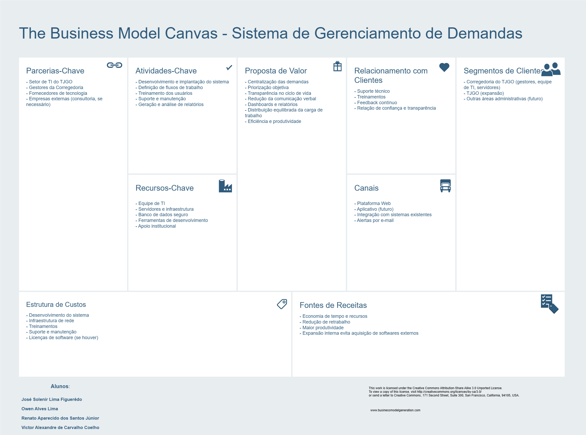

# Sistema de Gerenciamento de Demandas - Corregedoria TJGO

*O contexto e a proposta de valor deste projeto estão visualmente resumidos no Project Model Canvas (CanvasTJGO.png) e detalhados abaixo.*

## Requisitos do Projeto

Os requisitos listados abaixo detalham as funcionalidades (RFs), regras de arquitetura (RAs) e restrições não-funcionais (RNFs) necessárias para a construção desta solução.

---

### RA01 - Autenticação e Perfis de Usuário

**Objetivo:** Garantir login e papéis distintos (Servidor, Técnico, Gestor, Corregedor).
**Fluxo Principal:**

1. Usuário acessa tela de login.
2. Informa credenciais.
3. Sistema valida e aplica permissões.
   **Prioridade:** Essencial (pré-requisito de todos os outros RFs).

---

### RA02 - Cadastro de Técnicos

**Objetivo:** Permitir que gestores cadastrem técnicos de TI no sistema.
**Fluxo Principal:**

1. Gestor acessa Cadastro de Técnicos".
2. Informa dados básicos (nome  e-mail  área).
   **Pós-condição:** Técnico disponível para atribuição de chamados.
   **Prioridade:** Essencial." DEV (green)

---

### RF01 - Registro de Chamados

**Objetivo:** Permitir que o servidor registre uma demanda de TI.
**Atores:** Servidor do Tribunal
**Pré-condições:** Usuário autenticado no sistema.
**Fluxo Principal:**

1. Servidor acessa Registrar Chamado".
2. Informa título  descrição  categoria  prioridade inicial e anexos (opcional).
3. Sistema valida os dados.
4. Chamado é registrado com um identificador único.
   **Pós-condição:** Chamado disponível para atribuição e acompanhamento.
   **Prioridade:** Alta (primeira funcionalidade a ser implementada)." DEV (green)

---

### RF02 - Atribuição Automática de Chamados

**Objetivo:** Distribuir automaticamente os chamados entre os técnicos.
**Atores:** Sistema, Gerente de TI
**Pré-condições:** Técnicos cadastrados + chamados pendentes de atribuição.
**Fluxo Principal:**

1. Chamado entra na fila de atribuição.
2. Sistema avalia a carga de trabalho da equipe.
3. Sistema atribui o chamado ao técnico mais adequado.
   **Fluxo Alternativo:** Se não houver técnico disponível, chamado permanece na fila.
   **Pós-condição:** Chamado vinculado a um técnico de TI.
   **Prioridade:** Alta.

---

### RF03 - Acompanhamento de Status

**Objetivo:** Usuário acompanha o status de seus chamados.
**Atores:** Servidor que abriu o chamado
**Pré-condições:** Usuário autenticado e com chamados registrados.
**Fluxo Principal:**

1. Usuário acessa Meus Chamados".
2. Sistema lista chamados (abertos  em andamento  concluídos).
3. Usuário seleciona um chamado e vê detalhes (atualizações  responsáveis).
   **Pós-condição:** Usuário tem visibilidade do progresso da sua demanda.
   **Prioridade:** Alta." DEV (green)

---

### RF04 - Definição de Prioridade de Chamados

**Objetivo:** Permitir ao gestor definir ou alterar prioridade de chamados.
**Atores:** Gestor
**Pré-condições:** Gestor autenticado.
**Fluxo Principal:**

1. Gestor acessa lista de chamados.
2. Seleciona um chamado.
3. Define prioridade (baixa, média, alta, crítica).
4. Sistema atualiza prioridade e reordena fila.
   **Pós-condição:** Chamados passam a ter tratamento conforme prioridade.
   **Prioridade:** Média.

---

### RF05 - Notificações de Novos Chamados

**Objetivo:** Notificar técnicos sobre novos chamados atribuídos.
**Atores:** Técnico de TI
**Pré-condições:** Técnico cadastrado e ativo.
**Fluxo Principal:**

1. Chamado é atribuído ao técnico.
2. Sistema envia notificação (e-mail, app ou sistema interno).
3. Técnico acessa chamado.
   **Pós-condição:** Técnico informado em tempo hábil.
   **Prioridade:** Média.

---

### RF06 - Histórico de Demandas

**Objetivo:** Permitir que o gestor visualize o histórico de chamados.
**Atores:** Gestor
**Pré-condições:** Gestor autenticado com perfil de gestão.
**Fluxo Principal:**

1. Gestor acessa Histórico de DemandAS".
2. Sistema apresenta chamados filtrados por período  tipo  unidade etc.
3. Gestor pode exportar ou analisar os dados.
   **Pós-condição:** Informações consolidadas para análise e planejamento.
   **Prioridade:** Média." DEV (green)

---

### RF07 - Relatórios Periódicos

**Objetivo:** Permitir que o gestor emita relatórios da equipe.
**Atores:** Gestor
**Pré-condições:** Gestor autenticado.
**Fluxo Principal:**

1. Gestor acessa Relatórios".
2. Define parâmetros (período  tipo  equipe etc.).
3. Sistema gera relatório visual e exportável (PDF  Excel).
   **Pós-condição:** Dados organizados para apresentação e análise.
   **Prioridade:** Baixa." DEV (green)

---

### RF08 - Dashboards de Indicadores

**Objetivo:** Exibir indicadores de desempenho para o corregedor.
**Atores:** Corregedor
**Pré-condições:** Corregedor autenticado e autorizado.
**Fluxo Principal:**

1. Corregedor acessa Indicadores".
2. Sistema apresenta métricas (tempo médio de atendimento  nº de chamados etc.).
3. Corregedor aplica filtros (período  tipo  unidade).
   **Pós-condição:** Corregedor tem visão consolidada da performance da equipe.
   **Prioridade:** Baixa." DEV (green)

---
## Requisitos Não Funcionais (RNF)

---
### RNF01: Desempenho
O sistema deve apresentar alta performance para garantir a fluidez do atendimento e da gestão.

- **Tempo de Resposta:** O tempo de resposta para operações comuns (abertura de chamados, visualização de *dashboards*, listagem/filtragem de demandas) não deve exceder **3 segundos** em 95% das requisições.
- **Carga Concorrente:** O sistema deve ser capaz de suportar [X] usuários concorrentes sem degradação perceptível da performance.

### RNF02: Segurança
O sistema deve garantir a confidencialidade, integridade e disponibilidade das informações das demandas.

- **Autenticação:** As senhas dos usuários devem ser armazenadas utilizando algoritmos de *hash* robustos (ex: bcrypt ou Argon2).
- **Controle de Sessão:** O sistema deve implementar um gerenciamento seguro de sessões, incluindo *timeouts* automáticos por inatividade.
- **Controle de Acesso (RBAC):** O sistema deve implementar o Controle de Acesso Baseado em Papéis, garantindo perfis distintos (Servidor, Técnico, Gestor, Corregedoria) com permissões claras.

### RNF03: Usabilidade
A interface deve ser projetada para minimizar a curva de aprendizado e permitir o uso eficiente em diferentes contextos.

- **Intuitividade:** O design deve ser limpo e seguir padrões de UI/UX consagrados, facilitando o registro e gerenciamento de demandas.
- **Responsividade:** A interface deve ser adaptável (responsiva) para operar de forma eficaz em *desktops* e dispositivos móveis.

### RNF04: Disponibilidade
O sistema é crítico para a operação da área de TI e deve estar acessível durante o horário de expediente.

- **Uptime:** O sistema deve garantir uma disponibilidade de **99,5%** durante o horário comercial (8h às 18h, seg-sex), excluindo janelas de manutenção programadas.

### RNF05: Auditabilidade e Rastreabilidade
Dada a necessidade de "transparência" e "controle" (contexto da Corregedoria), o rastreamento de ações é fundamental.

- **Logs de Auditoria:** Todas as ações críticas (criação, atribuição, alteração de status, fechamento de demanda) devem ser registradas em *logs*.
- **Histórico da Demanda:** Deve ser possível rastrear o histórico completo de uma demanda, identificando quem realizou cada alteração e quando.

### RNF06: Compatibilidade e Integração
O sistema deve se comunicar com outras ferramentas essenciais e ser acessível pelos usuários.

- **Compatibilidade de Navegadores:** A aplicação deve ser totalmente funcional nas versões mais recentes do *Google Chrome, Firefox* e *Microsoft Edge*.
- **Integração com E-mail (SMTP):** O envio de e-mails deve usar o protocolo SMTP corporativo.

### RNF07: Manutenibilidade
Para garantir o "suporte estratégico" e a longevidade do projeto, o sistema deve ser fácil de manter.

- **Qualidade de Código:** O código-fonte deve ser limpo, modular, seguir padrões de *design* e possuir documentação técnica adequada.
- **Testabilidade:** O sistema deve ser projetado para facilitar testes automatizados (unitários e de integração).

